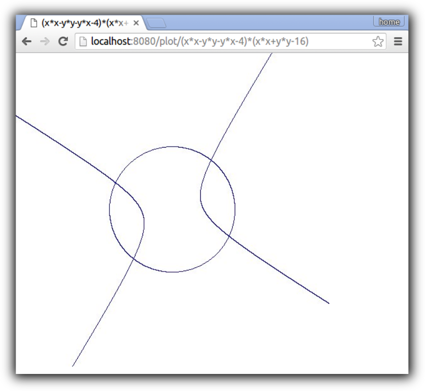

#jit

Toy just-in-time compiler for arithmetic expressions of floating-point variables x and y, like `sqrt(x*x + y*y) - 2*cos(x+1)`. Intended for fun and learning only. Written in Go and C.

The generated machine instructions are for x68-64 and are tested on Linux only.

## Parsing and the AST

Parsing transforms an expression, like `(x+1)*y` into an AST (Abstract Syntax Tree), like:

```
      *
     /  \ 
    +    y
   / \
  x   1
```

For simplicity, we use Go's built-in parser (package `go/parser`). However, we transform the Go AST into our own representation, to stay independent of `go/ast`'s internal details.

Our AST's nodes are of type `expr`, an interface implemented by the concrete types:

```
variable
constant
binexpr
callexpr
```

## Constant folding

We employ constant folding on the AST, i.e. replacing constant expressions by their numerical value. E.g.:

```
((x*x)/(1+sqrt(2))) -> ((x*x)/2.414213562373095)
```


## Compilation

### calling convention

We generate code for a function body, following the System V AMD64 ABI calling conention (x, y are passed via `xmm0`, `xmm1` respectively. Result returned in `xmm0`)

### locals

Internally, we keep on using `xmm0` and `xmm1` as the arguments for function calls or binary expressions, and store results in `xmm0`. The original arguments x and y are safely stored as local variables on the stack.

### registerization

We generate code using a stack machine strategy, but registerize into `xmm2`-`xmm7` if possible -- or spill to the stack otherwise.

For binary expressions, we evaluate the "deepest" branch first. This ensures we only need `O(log(N))` registers for `N` binary expression nodes. Otherwise, unbalanced expressions like `(x+(x+(x+(x+(x+(x+(x+(x+(x+(x+y))))))))))` would require `O(N)` registers and quickly start spilling to the stack.

Finally, we must take care that function calls do not destroy the contents of `xmm2`-`xmm7`. When a branch of a binary expression contains a function call, we simply never store the result of the other branch in a register.

The result is quite good, with most expressions of typical length hitting the stack only very few times, if at all:

```
2*(x+y)*(x-y)/2 :                                         4 registers,  0 stack spills
1+1+1+1+1+1+1+1+1+1+1+1+1+1+1+1+1+1+1+1+1+1+1+1 :         1 register,   0 stack spills
1+2+(3+2*4+((((5+6*2)+7)+(8))+9)+10*sin(2-x+y/3))+11 :    4 registers,  0 stack spill
1+x+(y+2*4+((((5+y*2)+7)+sqrt(x))+y)+10*sin(2-x+y/x))+y : 4 registers,  1 stack spill
```

### putting it all together

Putting it all together, the final code looks relatively OK for a small project like this. There are a few redundant `mov`s, but these are cheap. Immediate values and function calls could have been a bit more elegant, e.g. using `rip`-relative addressing.


As an example, `(x+1)*(2+sqrt(y+1))` compiles to:

```
push   %rbp
mov    %rsp,%rbp
sub    $0x10,%rsp
movq   %xmm0,%rax
mov    %rax,-0x8(%rbp)
movq   %xmm1,%rax
mov    %rax,-0x10(%rbp)
movabs $0x3ff0000000000000,%rax
movq   %rax,%xmm0
movq   %xmm0,%xmm2
mov    -0x10(%rbp),%rax
movq   %rax,%xmm0
movq   %xmm2,%xmm1
addsd  %xmm1,%xmm0
movabs $0x401c30,%rax
callq  *%rax
movq   %xmm0,%xmm2
movabs $0x4000000000000000,%rax
movq   %rax,%xmm0
movq   %xmm2,%xmm1
addsd  %xmm1,%xmm0
movq   %xmm0,%xmm2
movabs $0x3ff0000000000000,%rax
movq   %rax,%xmm0
movq   %xmm0,%xmm3
mov    -0x8(%rbp),%rax
movq   %rax,%xmm0
movq   %xmm3,%xmm1
addsd  %xmm1,%xmm0
movq   %xmm2,%xmm1
mulsd  %xmm1,%xmm0
add    $0x10,%rsp
pop    %rbp
retq   
```

## Assembler

The last stage is assembling binary machine code for the instructions our compiler has just output. x86-64 instruction encoding is a little bit _ehum_ convoluted, so we'll keep this stage as simple as possible. `asm.go` implements assembly for a handful instructions like `call` `mov` `movabsq` `push` `pop` `ret` `add` `sub` `mul` `div`.

We sidestep variable-length encoding by limiting ourselves mostly to registers `xmm0-7` in addition to the necessary `rbp`, `rsp` and `rax`. We also sidestep the _ehum_ "joy" of x86 addressing modes by using a load-store strategy, separating memory access from other operations.


## Dynamic loading & execution

Now that we have our binary machine code, we need to actually execute it.

First, we copy the code into a MMAP'ed memory segment and mark it as executable (calling unix' MPROTECT).

Then, we use a little C shim to call the code:

```
double eval(void *code, double x, double y) {
      double (*func)(double, double) = code;
      return func(x, y);
}
```

That's it.

## Performance

# Compilation

Compilation is fast. Compiling _and MMAPping_ `1+x+(3+y*4+((((x+y*2)+x)+sqrt(8))+y)+10*sin(2-x+y/3))+11` takes 82µs on my aging laptop with a 3rd gen i7-3612QM CPU.

# Execution

Execution speed is fast too. `1+x+(3+y*4+((((x+y*2)+x)+sqrt(8))+y)+10*sin(2-x+y/3))+11`` evaluates in 51 ns, while an ahead-of-time compiled version using the Go compiler evaluates in 41 ns. Not bad for a tiny toy compiler.

## Use case: implicit function plotter

Finally, as an example use case we use our just-in-time compiler to implement an implicit function plotter. Implicit curves are defined by equations like `x*x + y*y = 1` (a circle with radius 1). These are somewhat hard to plot. E.g. a 500x500 pixel plot requires the relation to be evaluated in all 250000 pixels.

Note that an explict plot, like `y=sqrt(1-x*x)` would only require 500 evaluations to obtain the same resolution. Hence implicit curves are a good use for our just-in-time compiler, as we're going to do _a lot_ of evaluations.

Here is the curve defined by `(x*x-y*y-y*x-4)*(x*x+y*y-16) = 0`:


